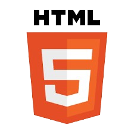
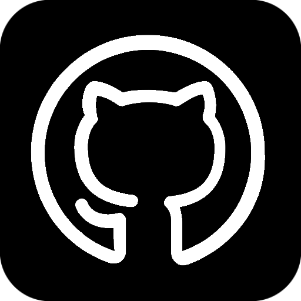

  

<h2 id="header" align="center">🔥 Hello ! I'm Martin LEBLANCS 🔥</h2>

### 👦 About me

  

Hey ! I'm Martin Leblancs, a versatile FullStack developer with experience in web, mobile, and software development.

I graduated from Epitech Paris, where I learned a lot about technology.
 I've worked on various projects and gained practical skills in creating software solutions.

I'm always curious about new technologies and eager to learn. 
 With my mix of education and hands-on experience, I'm ready to tackle any software challenge.

 
<h2></h2>

### 🧑‍🎓 As a Student 

#### 🇫🇷 Student at [Epitech Paris](https://www.epitech.eu/en/)

During my time at EPITECH Paris, I immersed myself in a dynamic learning environment focused on practical experience and problem-solving. 

The innovative pedagogy at EPITECH allowed me to develop a strong foundation in Computer Science while working on real-world projects.
 I gained valuable skills in programming, software development, and system administration, preparing me for the challenges of the tech industry.

#### 🇨🇳 Student at [Beijing jiaotong University, Beijing, China](https://www.bjtu.edu.cn/)

As part of my fourth-year exchange program at EPITECH, I had the opportunity to study at Beijing Jiaotong University in China for one year.

This experience was transformative in many ways.

Not only did it provide me with an invaluable academic experience, but it also allowed me to travel to Japan and South Korea, expanding my cultural horizons and broadening my perspective on technology and society. 

It was a life-changing experience that shaped my personal and professional growth in profound ways.

<h2></h2>

### 💻 Programming languages

<h2></h2>

### 💻 Programming frameworks

<h2></h2>

### 🛠️ Tools

<h2></h2>

### ⚡ My Stats

 

<h2></h2>

